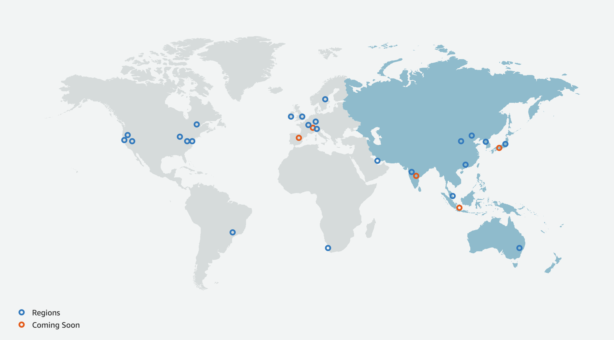
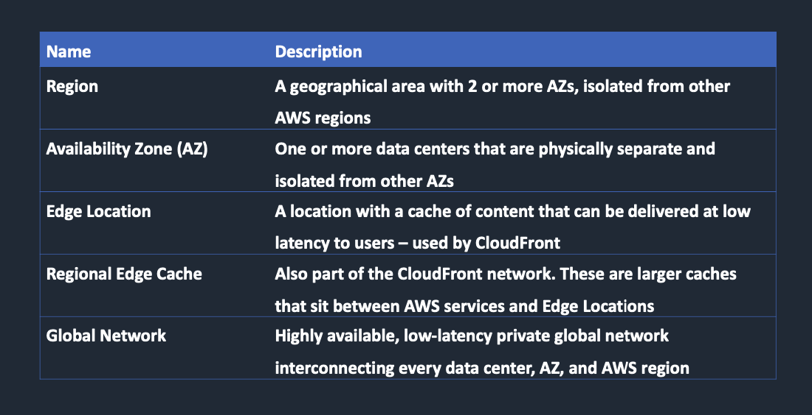
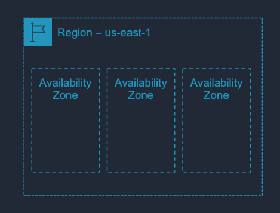

---
layout: post
title: "AWS Essentials : AWS Global Infrastructure"
description: "AWS Global Infrastructure"
date:   2020-01-01
tags: [AWS]
comments: false
references: [
   "Iam : https://aws.amazon.com/iam/",
   
]
---  

In this post we are going to discuss some essential topics we need to understand about AWS Global Infrastructure. Following are the major players in AWS Infrastructure. 
{:class="img-responsive centerimg"} 

Current numbers are as shown below.  
{:class="img-responsive centerimg" :height="500px" width="500px"} 

Each region comprises of multiple AZ's and each Az's comprises of multiple independent Data Centers connected via low latency network.

All Az's are connected via high bandwidth, redundant global network. 

As explained in the table above the regional cache location sits between the Cloud Front Origin and the edge location near customer. 

